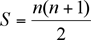
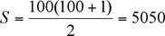

## Dunning Kruger Effect

According to [Wikipedia](https://en.wikipedia.org/wiki/Dunning%E2%80%93Kruger_effect), *the Dunning–Kruger effect is a cognitive bias in which people of low ability have illusory superiority and mistakenly assess their cognitive ability as greater than it is.* Out in real world, this bias is present even in above average people, resulting in them misjudging/overestimating their true capability.

To tell you the truth, I see myself a fairly capable C++ programmer who know roughly 80% of whatever there is to know about C++, ... until recently: I read Modern C++ Design, a 2003 book, by Andrei Alexandrescu. I always put off reading this book, despite recommended by a coworker. I presume this is a very much outdated book by today's standard. I got a refreshing read on the amazing typelist, the cornerstone of template meta-programming. Typelist is being used to implement the tuple, is_integral<>, is_arithmetic<> in Loki library by same author, now maintained by a group of volunteers. Typelist is used heavily in [Compile Time Regular Expressions](https://www.youtube.com/watch?v=QM3W36COnE4) library by Hana Dusíková to achieve excellent execution speed.

The reason Dunning–Kruger effect is so pervalent in our society because we do not precisely know what we do not know.

### Show how you would add 2 floating number by hand

15 years ago, in a coding interview for a junior position, I was asked to add 2 floating number in scientific notation by hand on the white board. Strictly speaking, this is not a coding question but pre-algebra one. I do not remember the exact numbers so I replace them with coefficients exactly.

a.10^x * b.10^y

Before computing the long multiplication, I first flatten the numbers into decimals. I took a lot care to make sure I got correct result. Fast forward 15 years to today, I came upon this realization after studying floating point format: My answer, albeit correct, was not the one which the interviewers were out looking for. They were probably hoping for this answer.

(a*b).10^(x+y)

### Write code to sum up from 1 to 100

One has to especially careful when the question is deceptively simple, for instance, add up all the numbers from 1 to 100. A simple summing loop wouldn't suffice to satisfy your interviewer. He is looking for you to give answer of O(1) time complexity. Of course, yours truly gave the same answer as the then 8th grade Carl Friedrich Gauss, the math child prodigy.

<br/>



As it turns out Singapore education system teaches elementary school pupils this Gauss trick.

I want to ask reader a question: Does it mean every Singaporeans, including me, who's been through the Singapore education, as talented as Gauss? There are 2 types of programming experts, consumer and producer. Consumer experts just make use of frameworks and design patterns by others while innovating nothing of their own and producer experts comes out with solutions/pattern to existing problems.

Surely, knowing the answer because you just learnt of it from another person does not legitimately make you an expert. However, in fact, not a small number of interviewers actually believe if you give the Gauss answer or make use of exclusive OR to swap two integers, your programming skills must be at amazing level. This is absolutely absurd at extraordinary level!

### Exclusive OR to swap 2 integers

A common interview question where job candidate are asked to [swap 2 integers without third variable](https://en.wikipedia.org/wiki/XOR_swap_algorithm).

```
a ^= b;
b ^= a;
a ^= b;
```

If you do swapping via a temporary variable and examine the assembly instructions at [Godbolt Compiler Explorer](https://godbolt.org/), you notice that compiler does not optimize the code to XOR swapping because for XOR swapping to work, there has to be a check that ensures the 2 variables are not the same and that check makes the execution slower than the third variable swapping method. And XOR swapping is strictly for integers and nothing else: it cannot be used to swap pointers.


### Embedded system interview question: Bubble sort

If a job candidate is applying for embedded system position in Singapore, most likely than not, he is asked to write a bubble sort function without pseudo code or instructions! I was admittedly stumped by this question. Why bubble sort, the slowest sort? Why not insertion sort or other sort algorithm like merge sort? Sometimes this is the only interview question on the test. I asked my tester how many people managed to answer that correctly. He said almost all, matter-of-factly. Obviously, every job applicant in the embedded sector, memorise bubble sort by heart. Just like some programmers memorised XOR swap for interviews.

Admittedly, I was not familiar with what embedded system programming job and reponsibility entails, this could be the only feasible sort algorithm on bare metal system where every piece of memory has to be pre-allocated and the number of stored items to be sorted remains small. So it could be a legitimate question for a embedded programmer.

Many hiring managers graduated school decades ago and has not keep abreast with the latest developement in software development. In my opinion, coding test should be restricted to test the problem solving skills, not minutiae that can be easily googled or syntax errors that can be caught by compilers.


### The goal and purpose of this website

For a budding programmer, what stands between you and your dream job/company? A coding test! A grueling one probably! Sometimes you can only answer the coding questions confidently after many years of pain-stakingly gathering knowledge on all the nuances, ins and outs of C++. The aim of this website seeks to bridge the gulf in your knowledge. I do not purported to know every answer or everything there is to know about C++. This is by no means one man endeavor. I need all the help I can get. If you have any interview question, feel free to drop me an email. You are also welcome to email me your interview experience. I'll love to hear what you went through and your thoughts. When my given answer is not deemed to the most optimal by you, please give me a kind nudge to enlighten me and other future programmers.


My email is shaovoon [at] yahoo [dot] com


